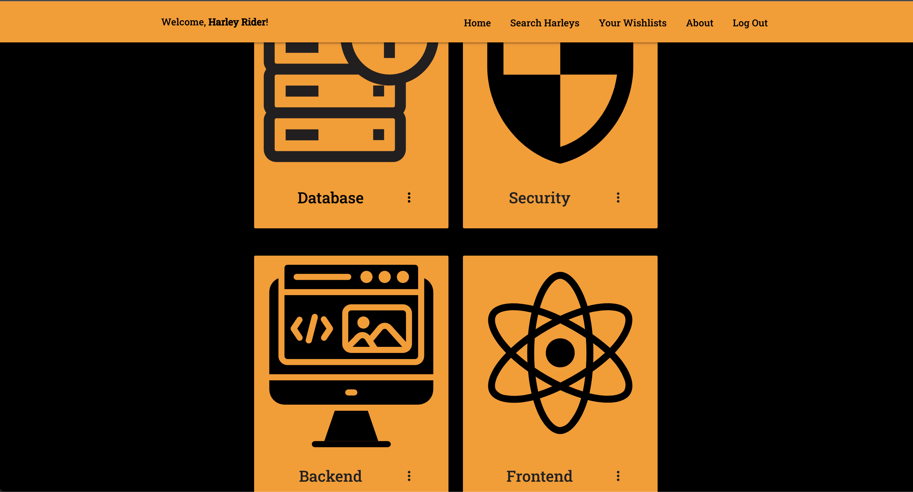

# Harley Finder
A single page web application with a database of over 1500 Harley-Davidson motorcycles.  Search my year range and/or model, create motorcycle wishlists, and add motorcycles you're interested in to your wishlist.

### Screenshots
- Log In / Sign Up
    - 
    - 
- Home Page
    - 
- About Page
    - 
- Wishlist Index Page
    - 
- Wishlist Detail Page
    - 
- Search Page
    - 

### Technologies Used
- Frontend
    - HTML
    - CSS
    - JavaScript
    - React.js
    - Materialize CSS
- Backend
    - Express
    - Node.js
    - Mongoose
    - MongoDb

### Getting Started
- Deployed application:
    - https://harley-finder.onrender.com/
- Trello board:
    - https://trello.com/b/QqoxwaEX/sei-project-four

### Next Steps
- Implement functionality to compare multiple models against each other.
- Implement sharing of wishlists with other users/public wishlists.
- Refine responsivness for mobile screens.